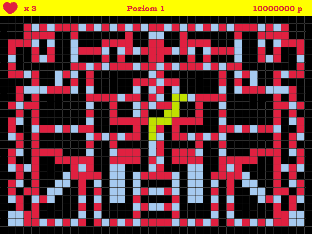

# WAZ-RZECZNY
Game similar to "Magic Serpent" (1991), written using allegro library.

## Important !!

This was my very first project.. like ever.  
I know that the code is terrible (yet it works), but I didn't even know the classes and functions existed at that moment, so it's really messy and unnecessarily long.

## Technologies

* C++
* Allegro Library

## Functions

* Snake growing in size
* Snake turning on its own when there is only one way to go
* Snake going faster and faster when it's hungry
* Scoreboard

